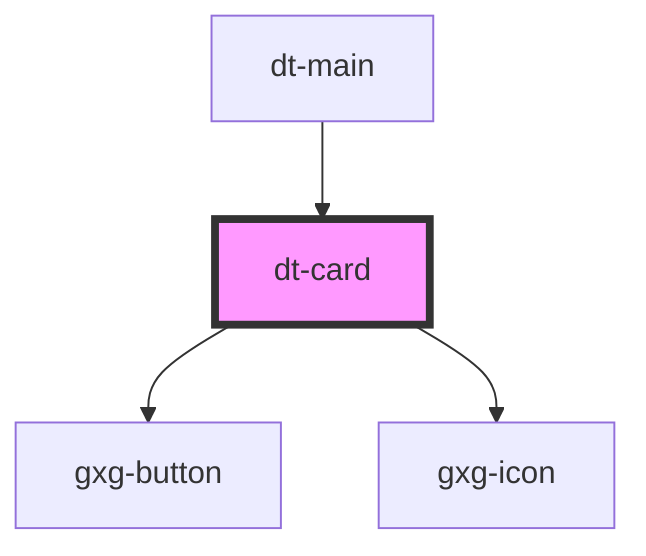

# dt-card

<!-- Auto Generated Below -->

## Properties

| Property     | Attribute     | Description | Type      | Default     |
| ------------ | ------------- | ----------- | --------- | ----------- |
| `cardTitle`  | `card-title`  |             | `string`  | `undefined` |
| `index`      | `index`       |             | `number`  | `undefined` |
| `mode`       | `mode`        |             | `string`  | `"preview"` |
| `readOnly`   | `read-only`   |             | `boolean` | `false`     |
| `tokenGroup` | `token-group` |             | `string`  | `undefined` |
| `tokenId`    | `token-id`    |             | `string`  | `undefined` |
| `tokenValue` | `token-value` |             | `string`  | `undefined` |

## Events

| Event            | Description | Type               |
| ---------------- | ----------- | ------------------ |
| `cardClosed`     |             | `CustomEvent<any>` |
| `cardDeleted`    |             | `CustomEvent<any>` |
| `cardDuplicated` |             | `CustomEvent<any>` |
| `colorSaved`     |             | `CustomEvent<any>` |

## Dependencies

### Used by

 - [dt-main](../main)

### Depends on

- gxg-button
- gxg-icon

### Graph

----------------------------------------------

*Built with [StencilJS](https://stenciljs.com/)*
