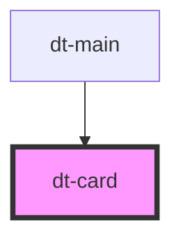

# dt-card

<!-- Auto Generated Below -->

## Properties

| Property | Attribute | Description | Type     | Default          |
| -------- | --------- | ----------- | -------- | ---------------- |
| `cardId` | `card-id` |             | `string` | `undefined`      |
| `mode`   | `mode`    |             | `string` | `"non-editable"` |
| `title`  | `title`   |             | `string` | `undefined`      |

## Events

| Event            | Description | Type               |
| ---------------- | ----------- | ------------------ |
| `cardClosed`     |             | `CustomEvent<any>` |
| `cardDeleted`    |             | `CustomEvent<any>` |
| `cardDuplicated` |             | `CustomEvent<any>` |
| `colorSaved`     |             | `CustomEvent<any>` |

## Dependencies

### Used by

 - [dt-main](../main)

### Graph

----------------------------------------------

*Built with [StencilJS](https://stenciljs.com/)*
