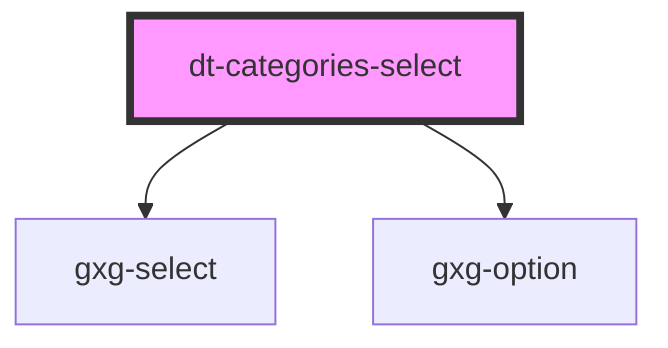

# dt-card

<!-- Auto Generated Below -->

## Properties

| Property        | Attribute | Description | Type     | Default     |
| --------------- | --------- | ----------- | -------- | ----------- |
| `selectedModel` | --        |             | `object` | `undefined` |

## Dependencies

### Depends on

- gxg-select
- gxg-option

### Graph

----------------------------------------------

*Built with [StencilJS](https://stenciljs.com/)*
