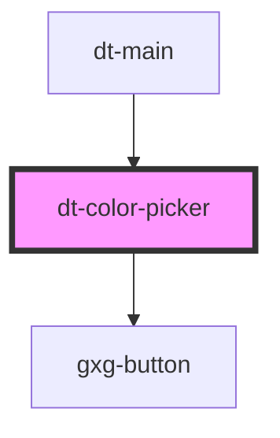

# dt-color-picker

<!-- Auto Generated Below -->

## Properties

| Property | Attribute | Description | Type     | Default |
| -------- | --------- | ----------- | -------- | ------- |
| `color`  | `color`   |             | `string` | `""`    |
| `title`  | `title`   |             | `string` | `""`    |

## Events

| Event            | Description | Type               |
| ---------------- | ----------- | ------------------ |
| `nameInputEvent` |             | `CustomEvent<any>` |
| `save`           |             | `CustomEvent<any>` |

## Dependencies

### Used by

 - [dt-main](../main)

### Depends on

- gxg-button

### Graph

----------------------------------------------

*Built with [StencilJS](https://stenciljs.com/)*
