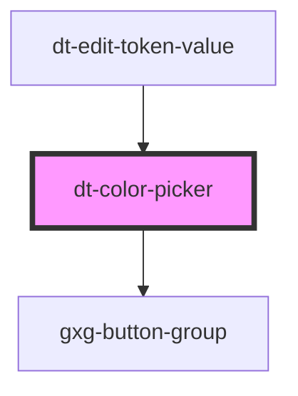

# dt-color-picker

<!-- Auto Generated Below -->

## Properties

| Property    | Attribute    | Description | Type     | Default |
| ----------- | ------------ | ----------- | -------- | ------- |
| `cardTitle` | `card-title` |             | `string` | `""`    |
| `value`     | `value`      |             | `string` | `""`    |

## Events

| Event            | Description | Type               |
| ---------------- | ----------- | ------------------ |
| `nameInputEvent` |             | `CustomEvent<any>` |
| `save`           |             | `CustomEvent<any>` |

## Dependencies

### Used by

 - [dt-edit-token-value](../edit-token-value)

### Depends on

- gxg-button-group

### Graph

----------------------------------------------

*Built with [StencilJS](https://stenciljs.com/)*
