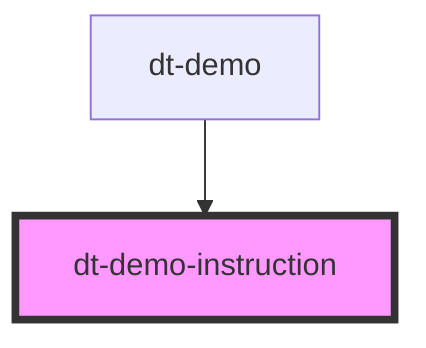

# dt-card

<!-- Auto Generated Below -->

## Properties

| Property             | Attribute             | Description | Type     | Default     |
| -------------------- | --------------------- | ----------- | -------- | ----------- |
| `arrowPosition`      | `arrow-position`      |             | `string` | `undefined` |
| `instructionMessage` | `instruction-message` |             | `string` | `undefined` |
| `instructionNumber`  | `instruction-number`  |             | `number` | `undefined` |

## Dependencies

### Used by

 - [dt-demo](../dt-demo)

### Graph

----------------------------------------------

*Built with [StencilJS](https://stenciljs.com/)*
