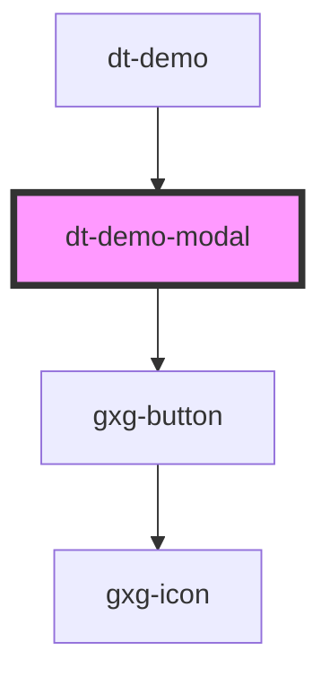

# dt-card

<!-- Auto Generated Below -->

## Properties

| Property         | Attribute          | Description | Type     | Default     |
| ---------------- | ------------------ | ----------- | -------- | ----------- |
| `demoItemNumber` | `demo-item-number` |             | `number` | `undefined` |

## Events

| Event                    | Description | Type               |
| ------------------------ | ----------- | ------------------ |
| `nextItem`               |             | `CustomEvent<any>` |
| `reloadApplicationEvent` |             | `CustomEvent<any>` |

## Dependencies

### Used by

 - [dt-demo](../dt-demo)

### Depends on

- gxg-button

### Graph

----------------------------------------------

*Built with [StencilJS](https://stenciljs.com/)*
