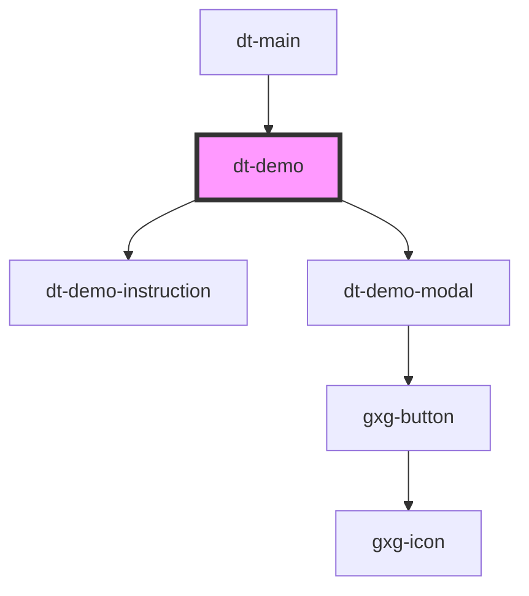

# dt-card

<!-- Auto Generated Below -->

## Properties

| Property         | Attribute          | Description | Type      | Default |
| ---------------- | ------------------ | ----------- | --------- | ------- |
| `demoItemNumber` | `demo-item-number` |             | `number`  | `0`     |
| `initiateDemo`   | `initiate-demo`    |             | `boolean` | `false` |

## Events

| Event               | Description | Type               |
| ------------------- | ----------- | ------------------ |
| `initiateDemoEvent` |             | `CustomEvent<any>` |

## Dependencies

### Used by

 - [dt-main](../main)

### Depends on

- [dt-demo-instruction](../dt-demo-instruction)
- [dt-demo-modal](../dt-demo-modal)

### Graph

----------------------------------------------

*Built with [StencilJS](https://stenciljs.com/)*
