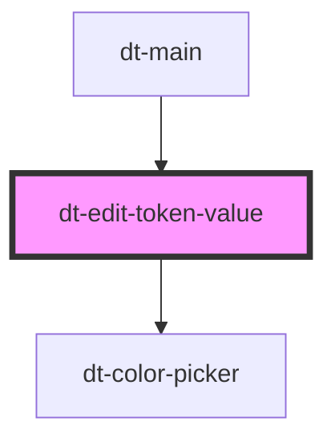

# dt-edit-token-value

<!-- Auto Generated Below -->

## Properties

| Property     | Attribute     | Description | Type     | Default        |
| ------------ | ------------- | ----------- | -------- | -------------- |
| `tokenGroup` | `token-group` |             | `string` | `undefined`    |
| `tokenId`    | `token-id`    |             | `string` | `undefined`    |
| `tokenTitle` | `token-title` |             | `string` | `undefined`    |
| `type`       | `type`        |             | `string` | `"input-text"` |
| `value`      | `value`       |             | `string` | `undefined`    |

## Events

| Event           | Description | Type               |
| --------------- | ----------- | ------------------ |
| `saveNewValues` |             | `CustomEvent<any>` |

## Dependencies

### Used by

 - [dt-main](../main)

### Depends on

- [dt-color-picker](../color-picker)

### Graph

----------------------------------------------

*Built with [StencilJS](https://stenciljs.com/)*
