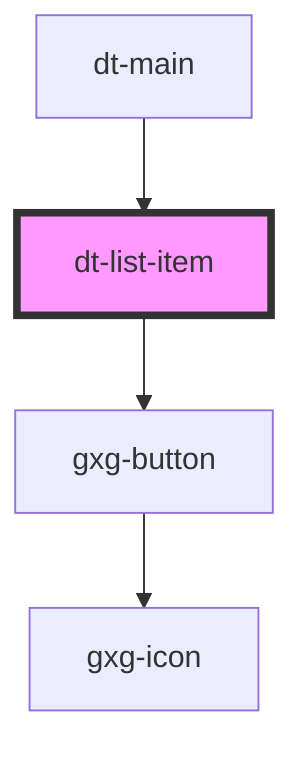

# dt-card

<!-- Auto Generated Below -->

## Properties

| Property        | Attribute        | Description | Type      | Default     |
| --------------- | ---------------- | ----------- | --------- | ----------- |
| `index`         | `index`          |             | `number`  | `undefined` |
| `isSelected`    | `is-selected`    |             | `boolean` | `false`     |
| `itemTitle`     | `item-title`     |             | `string`  | `undefined` |
| `mode`          | `mode`           |             | `string`  | `"preview"` |
| `newItem`       | `new-item`       |             | `boolean` | `false`     |
| `readOnly`      | `read-only`      |             | `boolean` | `false`     |
| `tokenCategory` | `token-category` |             | `string`  | `undefined` |
| `tokenGroup`    | `token-group`    |             | `string`  | `undefined` |
| `tokenId`       | `token-id`       |             | `string`  | `undefined` |
| `tokenValue`    | `token-value`    |             | `string`  | `undefined` |

## Events

| Event             | Description | Type               |
| ----------------- | ----------- | ------------------ |
| `addNewToken`     |             | `CustomEvent<any>` |
| `cardClosed`      |             | `CustomEvent<any>` |
| `editToken`       |             | `CustomEvent<any>` |
| `itemActivated`   |             | `CustomEvent<any>` |
| `tokenDeleted`    |             | `CustomEvent<any>` |
| `tokenDuplicated` |             | `CustomEvent<any>` |
| `tokenSaved`      |             | `CustomEvent<any>` |

## Dependencies

### Used by

 - [dt-main](../main)

### Depends on

- gxg-button

### Graph

----------------------------------------------

*Built with [StencilJS](https://stenciljs.com/)*
