# dt-main

<!-- Auto Generated Below -->

## Properties

| Property             | Attribute              | Description | Type      | Default     |
| -------------------- | ---------------------- | ----------- | --------- | ----------- |
| `model`              | --                     |             | `Model`   | `undefined` |
| `needHelpUrl`        | `need-help-url`        |             | `string`  | `"#"`       |
| `selectedTokenGroup` | `selected-token-group` |             | `string`  | `undefined` |
| `selectedTokenId`    | `selected-token-id`    |             | `string`  | `undefined` |
| `tokenDeleted`       | `token-deleted`        |             | `boolean` | `undefined` |

## Events

| Event          | Description | Type               |
| -------------- | ----------- | ------------------ |
| `saveNewValue` |             | `CustomEvent<any>` |

## Dependencies

### Depends on

- [dt-token-font](../token-font)
- [dt-edit-token-value](../edit-token-value)
- [dt-token-font-size](../token-font-size)
- [dt-token-color-palette](../token-color-palette)
- [dt-token-spacing](../token-spacing)
- [dt-token-border](../token-border)
- [dt-token-radius](../token-radius)
- [dt-token-shadow](../token-shadow)
- [dt-token-opacity](../token-opacity)
- [dt-token-z-index](../token-z-index)
- [dt-token-timing-function](../token-timing-function)
- [dt-token-time](../token-time)
- [dt-token-media-query](../token-media-query)
- [dt-quote](../quote)
- [dt-card](../card)
- [dt-tabs](../tabs)
- [dt-tab-bar](../tab-bar)
- [dt-tab-button](../tab-button)
- [dt-tab](../tab)
- gxg-alert

### Graph

```mermaid
graph TD;
  dt-main --> dt-token-font
  dt-main --> dt-edit-token-value
  dt-main --> dt-token-font-size
  dt-main --> dt-token-color-palette
  dt-main --> dt-token-spacing
  dt-main --> dt-token-border
  dt-main --> dt-token-radius
  dt-main --> dt-token-shadow
  dt-main --> dt-token-opacity
  dt-main --> dt-token-z-index
  dt-main --> dt-token-timing-function
  dt-main --> dt-token-time
  dt-main --> dt-token-media-query
  dt-main --> dt-quote
  dt-main --> dt-card
  dt-main --> dt-tabs
  dt-main --> dt-tab-bar
  dt-main --> dt-tab-button
  dt-main --> dt-tab
  dt-main --> gxg-alert
  dt-edit-token-value --> gxg-form-input-text
  dt-edit-token-value --> dt-color-picker
  dt-edit-token-value --> gxg-form-select
  dt-edit-token-value --> gxg-stepper
  dt-edit-token-value --> gxg-form-textarea
  dt-edit-token-value --> gxg-button
  gxg-form-input-text --> gxg-icon
  dt-color-picker --> gxg-button-group
  dt-quote --> gxg-button
  dt-card --> gxg-button
  dt-card --> gxg-icon
  dt-tab-bar --> gxg-button
  dt-tab-bar --> gxg-icon
  gxg-alert --> gxg-icon
  gxg-alert --> gxg-button
  style dt-main fill:#f9f,stroke:#333,stroke-width:4px
```

----------------------------------------------

*Built with [StencilJS](https://stenciljs.com/)*
