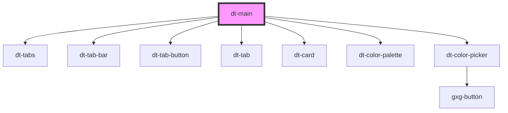

# dt-main

<!-- Auto Generated Below -->

## Properties

| Property | Attribute | Description | Type    | Default     |
| -------- | --------- | ----------- | ------- | ----------- |
| `model`  | --        |             | `Model` | `undefined` |

## Dependencies

### Depends on

- [dt-tabs](../tabs)
- [dt-tab-bar](../tab-bar)
- [dt-tab-button](../tab-button)
- [dt-tab](../tab)
- [dt-card](../card)
- [dt-color-palette](../color-palette)
- [dt-color-picker](../color-picker)

### Graph

----------------------------------------------

*Built with [StencilJS](https://stenciljs.com/)*
