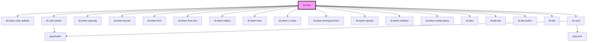

# dt-main

<!-- Auto Generated Below -->

## Properties

| Property | Attribute | Description | Type    | Default     |
| -------- | --------- | ----------- | ------- | ----------- |
| `model`  | --        |             | `Model` | `undefined` |

## Dependencies

### Depends on

- [dt-token-color-palette](../token-color-palette)
- [dt-color-picker](../color-picker)
- [dt-token-spacing](../token-spacing)
- [dt-token-border](../token-border)
- [dt-token-font](../token-font)
- [dt-token-font-size](../token-font-size)
- [dt-token-radius](../token-radius)
- [dt-token-time](../token-time)
- [dt-token-z-index](../token-z-index)
- [dt-token-timing-function](../token-timing-function)
- [dt-token-opacity](../token-opacity)
- [dt-token-shadow](../token-shadow)
- [dt-token-media-query](../token-media-query)
- [dt-tabs](../tabs)
- [dt-tab-bar](../tab-bar)
- [dt-tab-button](../tab-button)
- [dt-tab](../tab)
- [dt-card](../card)

### Graph

----------------------------------------------

*Built with [StencilJS](https://stenciljs.com/)*
