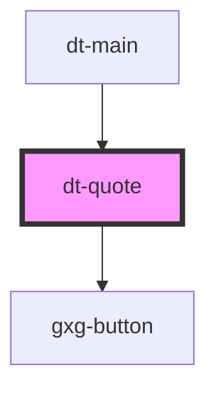

# dt-color-palette

<!-- Auto Generated Below -->

## Properties

| Property      | Attribute      | Description | Type     | Default                  |
| ------------- | -------------- | ----------- | -------- | ------------------------ |
| `author`      | `author`       |             | `string` | `undefined`              |
| `buttonLabel` | `button-label` |             | `string` | `"Add your first token"` |
| `quote`       | `quote`        |             | `string` | `undefined`              |
| `token`       | `token`        |             | `string` | `undefined`              |

## Dependencies

### Used by

 - [dt-main](../main)

### Depends on

- gxg-button

### Graph

----------------------------------------------

*Built with [StencilJS](https://stenciljs.com/)*
