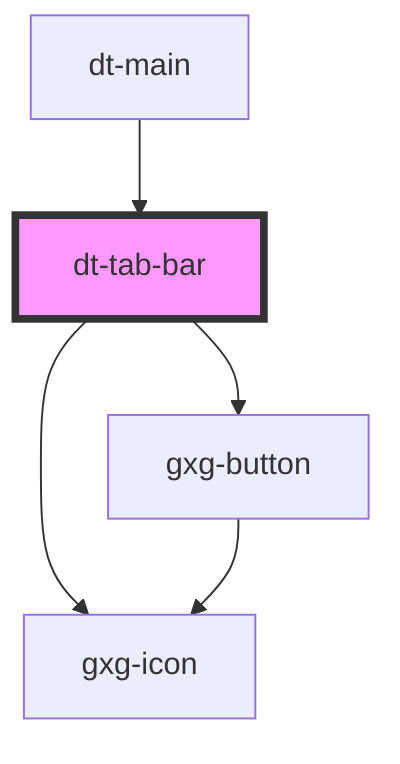

# dt-tab-bar

<!-- Auto Generated Below -->

## Dependencies

### Used by

 - [dt-main](../main)

### Depends on

- gxg-button
- gxg-icon

### Graph

----------------------------------------------

*Built with [StencilJS](https://stenciljs.com/)*
