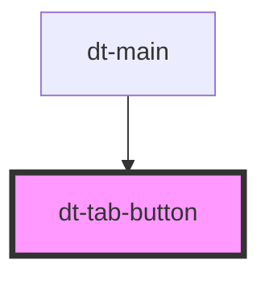

# dt-tab-button

<!-- Auto Generated Below -->

## Properties

| Property     | Attribute     | Description | Type      | Default     |
| ------------ | ------------- | ----------- | --------- | ----------- |
| `disabled`   | `disabled`    |             | `boolean` | `false`     |
| `isSelected` | `is-selected` |             | `boolean` | `false`     |
| `tab`        | `tab`         |             | `string`  | `undefined` |

## Events

| Event          | Description | Type               |
| -------------- | ----------- | ------------------ |
| `tabActivated` |             | `CustomEvent<any>` |

## Dependencies

### Used by

 - [dt-main](../main)

### Graph

----------------------------------------------

*Built with [StencilJS](https://stenciljs.com/)*
