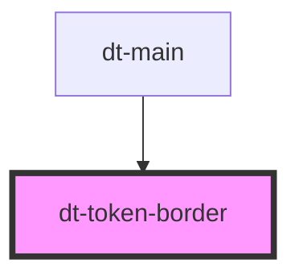

# dt-color-palette

<!-- Auto Generated Below -->

## Properties

| Property      | Attribute      | Description | Type     | Default |
| ------------- | -------------- | ----------- | -------- | ------- |
| `borderWidth` | `border-width` |             | `string` | `"0px"` |

## Dependencies

### Used by

 - [dt-main](../main)

### Graph

----------------------------------------------

*Built with [StencilJS](https://stenciljs.com/)*
