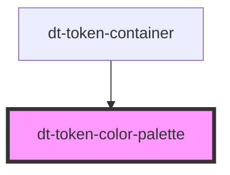

# dt-color-palette

<!-- Auto Generated Below -->

## Properties

| Property | Attribute | Description | Type     | Default  |
| -------- | --------- | ----------- | -------- | -------- |
| `color`  | `color`   |             | `string` | `"#CCC"` |

## Dependencies

### Used by

 - [dt-token-container](../token-container)

### Graph

----------------------------------------------

*Built with [StencilJS](https://stenciljs.com/)*
