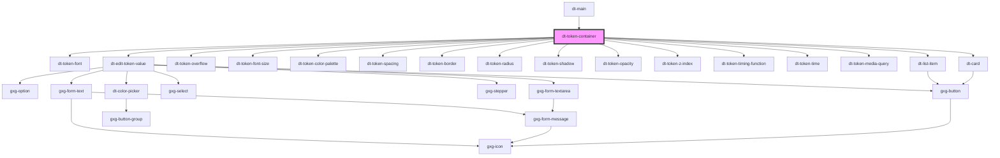

# dt-card

<!-- Auto Generated Below -->

## Properties

| Property             | Attribute              | Description | Type      | Default     |
| -------------------- | ---------------------- | ----------- | --------- | ----------- |
| `cardAsListItem`     | `card-as-list-item`    |             | `boolean` | `false`     |
| `index`              | `index`                |             | `number`  | `undefined` |
| `isSelected`         | `is-selected`          |             | `boolean` | `false`     |
| `key`                | `key`                  |             | `string`  | `undefined` |
| `listItem`           | `list-item`            |             | `boolean` | `undefined` |
| `readOnly`           | `read-only`            |             | `boolean` | `undefined` |
| `selectedTokenGroup` | `selected-token-group` |             | `string`  | `undefined` |
| `selectedTokenId`    | `selected-token-id`    |             | `string`  | `undefined` |
| `tokenCategory`      | `token-category`       |             | `string`  | `null`      |
| `tokenGroup`         | `token-group`          |             | `string`  | `undefined` |
| `tokenId`            | `token-id`             |             | `string`  | `undefined` |
| `tokenTitle`         | `token-title`          |             | `string`  | `undefined` |
| `tokenValue`         | `token-value`          |             | `string`  | `undefined` |

## Dependencies

### Used by

 - [dt-main](../main)

### Depends on

- [dt-token-font](../token-font)
- [dt-edit-token-value](../edit-token-value)
- [dt-token-overflow](../token-overflow)
- [dt-token-font-size](../token-font-size)
- [dt-token-color-palette](../token-color-palette)
- [dt-token-spacing](../token-spacing)
- [dt-token-border](../token-border)
- [dt-token-radius](../token-radius)
- [dt-token-shadow](../token-shadow)
- [dt-token-opacity](../token-opacity)
- [dt-token-z-index](../token-z-index)
- [dt-token-timing-function](../token-timing-function)
- [dt-token-time](../token-time)
- [dt-token-media-query](../token-media-query)
- [dt-list-item](../list-item)
- [dt-card](../card)

### Graph

----------------------------------------------

*Built with [StencilJS](https://stenciljs.com/)*
