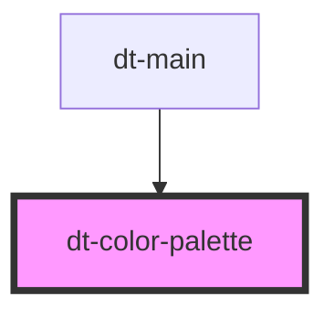

# dt-color-palette

This token defines the font-family, font-variant, and font-style properties, and all of them are included on the font file.

<!-- Auto Generated Below -->

## Properties

| Property | Attribute | Description | Type     | Default  |
| -------- | --------- | ----------- | -------- | -------- |
| `color`  | `color`   |             | `string` | `"#CCC"` |

## Dependencies

### Used by

- [dt-main](../main)

### Graph

---

_Built with [StencilJS](https://stenciljs.com/)_
