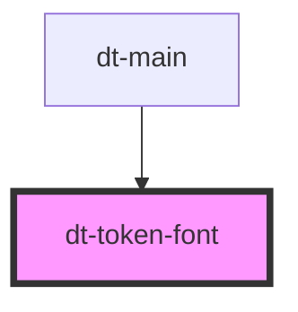

# dt-color-palette

This token defines the font-family, font-variant, and font-style properties, and all of them are included on the font file.

<!-- Auto Generated Below -->

## Properties

| Property | Attribute | Description | Type     | Default              |
| -------- | --------- | ----------- | -------- | -------------------- |
| `font`   | `font`    |             | `string` | `"OpenSans-Regular"` |

## Dependencies

### Used by

 - [dt-main](../main)

### Graph

----------------------------------------------

*Built with [StencilJS](https://stenciljs.com/)*
