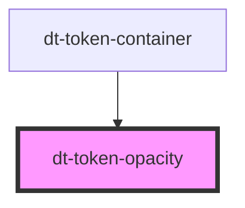

# dt-color-palette

<!-- Auto Generated Below -->

## Properties

| Property  | Attribute | Description | Type     | Default |
| --------- | --------- | ----------- | -------- | ------- |
| `opacity` | `opacity` |             | `string` | `"1"`   |

## Dependencies

### Used by

 - [dt-token-container](../token-container)

### Graph

----------------------------------------------

*Built with [StencilJS](https://stenciljs.com/)*
