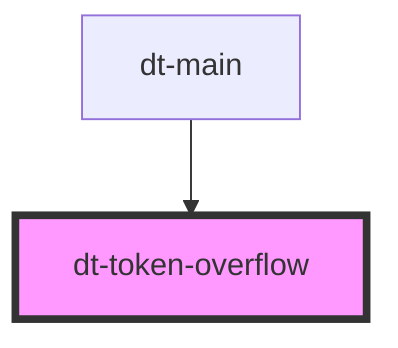

# dt-card

<!-- Auto Generated Below -->

<<<<<<< HEAD
## Properties

| Property | Attribute | Description | Type      | Default |
| -------- | --------- | ----------- | --------- | ------- |
| `bigger` | `bigger`  |             | `boolean` | `false` |

=======
>>>>>>> e709df1c0f7352c2e742aae97d46c64e62afb39d
## Dependencies

### Used by

 - [dt-main](../main)

### Graph

----------------------------------------------

*Built with [StencilJS](https://stenciljs.com/)*
