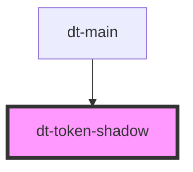

# dt-color-palette

<!-- Auto Generated Below -->

## Properties

| Property    | Attribute    | Description | Type     | Default  |
| ----------- | ------------ | ----------- | -------- | -------- |
| `boxShadow` | `box-shadow` |             | `string` | `"none"` |

## Dependencies

### Used by

 - [dt-main](../main)

### Graph

----------------------------------------------

*Built with [StencilJS](https://stenciljs.com/)*
