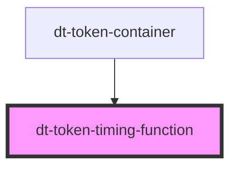

# dt-color-palette

<!-- Auto Generated Below -->

## Properties

| Property         | Attribute         | Description | Type                                                             | Default    |
| ---------------- | ----------------- | ----------- | ---------------------------------------------------------------- | ---------- |
| `timingFunction` | `timing-function` |             | `"ease" \| "ease-in" \| "ease-in-out" \| "ease-out" \| "linear"` | `"linear"` |

## Dependencies

### Used by

 - [dt-token-container](../token-container)

### Graph

----------------------------------------------

*Built with [StencilJS](https://stenciljs.com/)*
