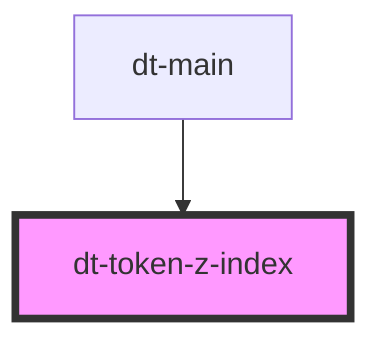

# dt-color-palette

<!-- Auto Generated Below -->

## Properties

| Property | Attribute | Description | Type     | Default |
| -------- | --------- | ----------- | -------- | ------- |
| `zIndex` | `z-index` |             | `number` | `0`     |

## Dependencies

### Used by

 - [dt-main](../main)

### Graph

----------------------------------------------

*Built with [StencilJS](https://stenciljs.com/)*
